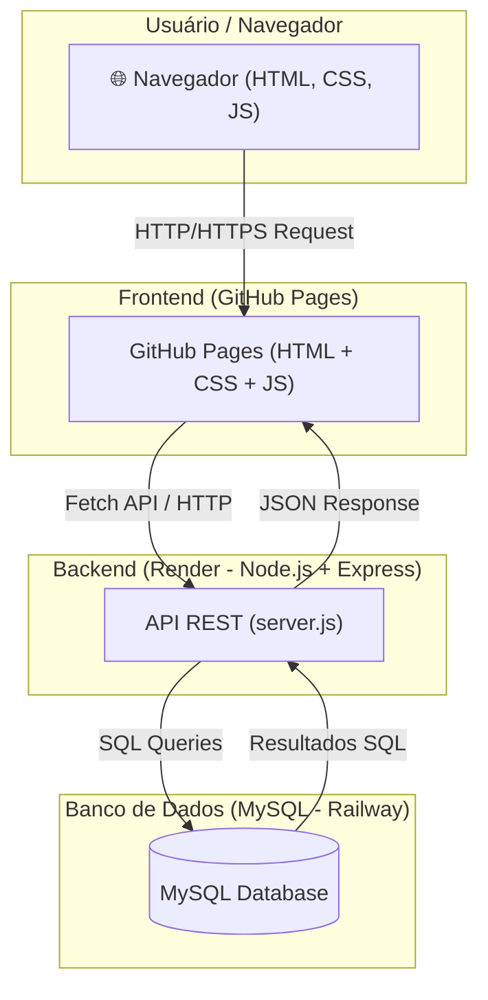
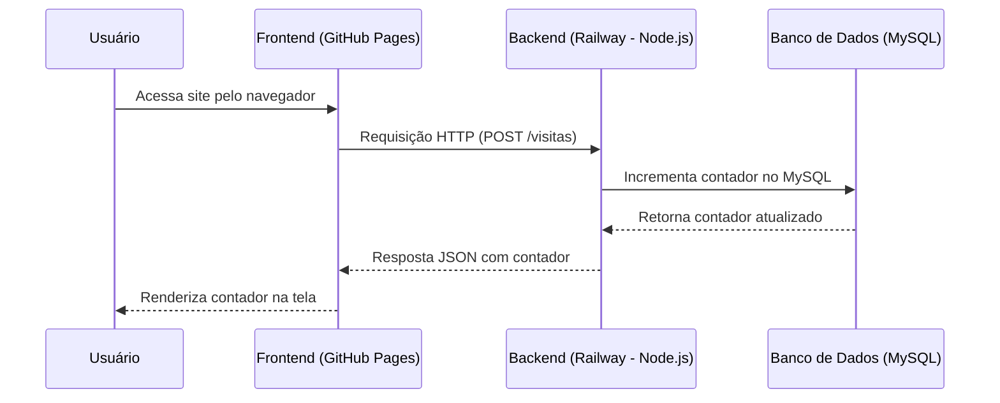

  
  
  
  
  


# 📰 Projeto
O **Portal de Notícias**

---

## 🚀 Tecnologias Utilizadas
- **Frontend:** HTML, CSS, JavaScript  
- **Backend:** Node.js + Express  
- **Banco de Dados:** MySQL  
- **Hospedagem:**  
  - Frontend: GitHub Pages  
  - Backend & Banco: Render


  ## 📊 Arquitetura
O sistema segue a arquitetura **cliente-servidor**.


---

## 📂 Estrutura do Projeto
```
/frontend      → Código do site (HTML, CSS, JS)
  ├── index.html
  ├── style.css
  └── script.js
/backend       → API em Node.js + Express
  ├── server.js       →
  ├── db.js     
  ├── package.json
  ├── package-lock.json
  └── .env   
/sql            
```
---
## 🔄 Fluxo de Requisição

---

## 💻 Como Executar Localmente

### 1. Clonar o repositório
```bash
git clone https://github.com/seu-usuario/contador-acessos.git
cd contador-acessos

```

### 2. Configurar Backend
```bash
cd backend
npm install

```

### 3. Criar arquivo `.env`
```env
DB_HOST=localhost
DB_PORT=3306
DB_USER=root
DB_PASS=sua_senha_mysql
DB_NAME=contador_site
PORT=3000

```

### 4. Criar banco e tabela no MySQL
```bash

CREATE DATABASE IF NOT EXISTS contador_site CHARACTER SET utf8mb4 COLLATE utf8mb4_unicode_ci;

USE contador_site;

CREATE TABLE IF NOT EXISTS visitas (
    id INT PRIMARY KEY,
    contador BIGINT NOT NULL DEFAULT 0,
    ultima_atualizacao TIMESTAMP DEFAULT CURRENT_TIMESTAMP ON UPDATE CURRENT_TIMESTAMP
);

INSERT INTO visitas (id, contador) VALUES (1, 0)
ON DUPLICATE KEY UPDATE contador = contador;

```

### 5. Rodar o servidor
```bash
npm start
# ou
npm run dev

```
A API estará disponível em:  
👉 http://localhost:3000  


## 🌍 Deploy em Produção

No **Railway**, configurar as variáveis de ambiente do .env:  
- DB_HOST  
- DB_PORT  
- DB_USER  
- DB_PASSWORD  
- DB_NAME  
- PORT  

Depois, usar a URL pública do backend no script.js do frontend hospedado no GitHub Pages.


